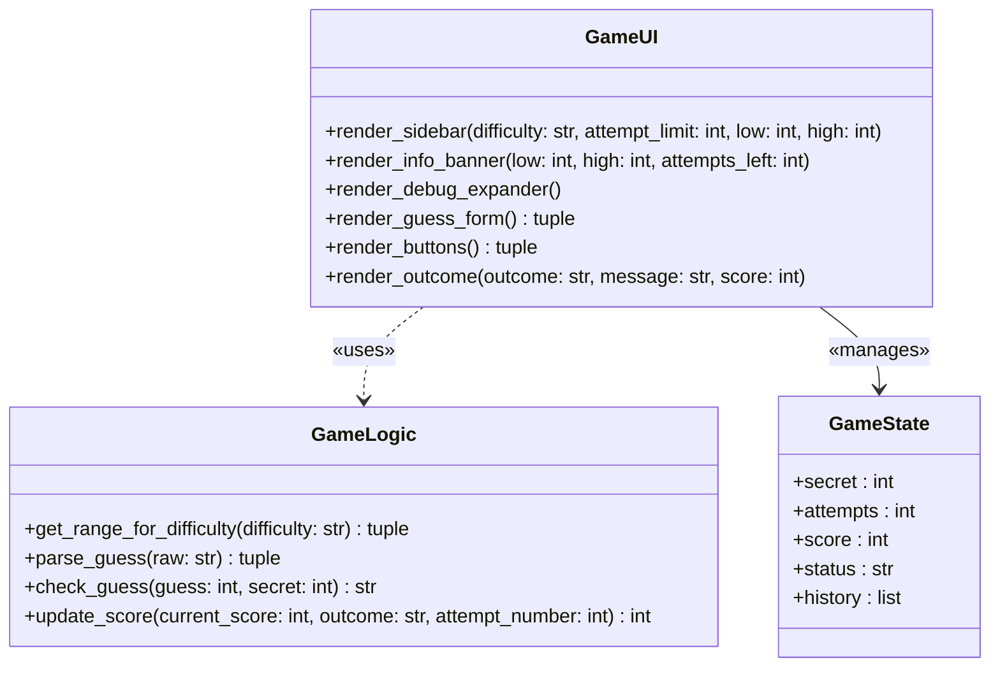

## Overview

The project is divided into two distinct layers: a pure game-logic layer (`logic_utils.py`) that contains all computation and rules, and a UI/session layer (`app.py`) that handles Streamlit rendering and session-state management. This separation matters because `logic_utils.py` can be unit-tested independently of any browser or Streamlit runtime, and it enforces the Single Responsibility Principle — the UI layer owns presentation, the logic layer owns correctness.

---

## UML Class Diagram

> `GameLogic` is a pure-function module — it holds no state and has no dependency on `GameUI` or `GameState`.

---

## Layer Responsibilities

| Layer | Responsibilities |
|-------|-----------------|
| **GameLogic** | Owns all game rules: difficulty ranges, guess parsing, win/loss evaluation, and score calculation. Must never import Streamlit, read session state, or render widgets. |
| **GameState** | Owns the mutable state of a single game session: the secret number, attempt counter, current score, game status, and guess history. Lives entirely inside `st.session_state`; has no methods of its own. |
| **GameUI** | Owns all Streamlit rendering: sidebar settings, info banner, debug expander, guess form, action buttons, and outcome messages. Must delegate all computation to `GameLogic` and persist results via `GameState`; it must never contain game-rule logic inline. |

---

## Data-Flow Narrative

1. **Input captured** — The user types a number into the `st.text_input` widget; the raw string is bound to `raw_guess`.
2. **Submission triggered** — The user clicks "Submit Guess 🚀" (or presses Enter once wrapped in `st.form`); Streamlit reruns the script with `submit = True`.
3. **Attempt counted** — `st.session_state.attempts` is incremented by 1 before any validation occurs.
4. **Input parsed** — `parse_guess(raw_guess)` is called; it returns `(ok, guess_int, err)`. If `ok` is `False`, the error message is displayed via `st.error(err)` and processing stops for this submission.
5. **History recorded** — On a valid parse, `guess_int` is appended to `st.session_state.history` for the debug expander.
6. **Secret retrieved** — The current secret is read from `st.session_state.secret` as an `int` (must never be cast to `str`).
7. **Guess evaluated** — `check_guess(guess_int, st.session_state.secret)` is called; it returns the outcome string `"Win"`, `"Too High"`, or `"Too Low"`.
8. **Hint displayed** — If `show_hint` is checked, the direction message mapped from the outcome is shown via `st.warning(message)`.
9. **Score updated** — `update_score(st.session_state.score, outcome, st.session_state.attempts)` is called and its return value is written back to `st.session_state.score`.
10. **Status resolved** — If `outcome == "Win"`, `st.session_state.status` is set to `"won"` and a success banner is shown. If the attempt count reaches `attempt_limit` without a win, `status` is set to `"lost"` and a game-over error is shown. On the next rerun, the status gate at line 140 prevents further submissions until "New Game" resets all state.

---

## Known Bugs

| ID | File | Location | Description |
|----|------|----------|-------------|
| A1 | app.py | line 4–65 | Logic functions defined in app.py instead of imported from logic_utils |
| A2 | app.py | line 37–40 | check_guess direction messages swapped (Go HIGHER / Go LOWER inverted) |
| A3 | app.py | line 158–161 | Even-attempt secret cast to str causes broken comparisons |
| A4 | app.py | line 96 | attempts initialised to 1 instead of 0 |
| A5 | app.py | line 121–128 | Enter key ignored — needs st.form |
| A6 | app.py | line 134–138 | new_game handler never resets status |
| A7 | app.py | line 136 | new_game uses hardcoded randint(1,100) instead of difficulty range |
| A8 | app.py | line 134–138 | new_game does not reset history |
| A9 | app.py | line 110 | st.info hardcodes "1 and 100" instead of {low}/{high} |
| A10 | app.py | line 80–84 | Easy has fewer attempts than Normal (6 < 8) |
| A11 | app.py | line 9–10 | Hard range (1–50) is narrower than Normal (1–100) |
| A12 | app.py | line 107 | st.subheader anchor not set explicitly |
| A13 | app.py | line 57–60 | update_score adds points on even-attempt Too High guess |
| L1 | logic_utils.py | line 1–27 | All four functions are unimplemented stubs (NotImplementedError) |
| L2 | logic_utils.py | line 15–21 | check_guess returns tuple but tests expect plain string |
